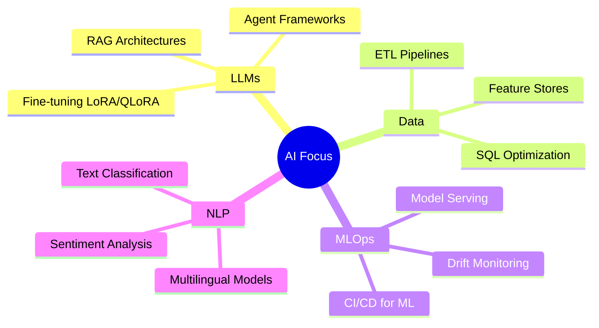

<div align="center">


<br/>

[](https://linkedin.com/in/yourprofile)
[](mailto:your@email.com)
[](https://github.com/YOUR_USERNAME)
[](https://huggingface.co/YOUR_USERNAME)

<br/>


</div>

---

## 🧬 About Me

```python
class AIEngineer:
    def __init__(self):
        self.name         = "Avinash"
        self.role         = "AI Engineer & Data Scientist"
        self.location     = "Rome, Italy 🇮🇹"
        self.languages    = ["Python", "SQL", "TypeScript"]
        self.focus        = ["LLMs", "RAG", "NLP", "MLOps", "Data Engineering"]
        self.clients      = "International — Europe & United States"
        self.currently    = "Exploring agent frameworks & LLM fine-tuning"

    def mission(self):
        return "Bridge the gap between AI research and production-grade systems."
```

---

## 🤖 AI & ML Expertise

<table>
<tr>
<td width="50%">

### 🧠 LLMs & Generative AI
- RAG pipeline design & vector store integration
- Prompt engineering & optimization strategies
- LLM agent workflows & tool-calling
- Fine-tuning with LoRA / QLoRA / RLHF / DPO
- Evaluation frameworks & hallucination mitigation
- OpenAI, Anthropic, Mistral, LLaMA

</td>
<td width="50%">

### 🔤 NLP & Text Analytics
- Tokenization, NER, POS tagging
- Sentiment analysis & opinion mining
- Text classification & semantic similarity
- Multilingual & cross-lingual NLP
- Embedding models & vector search
- Italian & multilingual corpus processing

</td>
</tr>
<tr>
<td width="50%">

### 📊 Data Engineering & ETL
- End-to-end pipeline architecture
- Structured & unstructured data processing
- Encoding normalization & schema validation
- Batch & streaming workflows
- Feature engineering & data quality
- SQL optimization & CTE-based reporting

</td>
<td width="50%">

### ⚙️ MLOps & Production AI
- Experiment tracking & model versioning
- CI/CD pipelines for ML workflows
- Kubernetes-based model serving
- Drift detection & performance monitoring
- Automated retraining pipelines
- REST/gRPC API deployment

</td>
</tr>
</table>

---

## 🛠️ Tech Stack

### 🐍 Languages


### 🤖 AI / ML Frameworks


### 📦 Data Engineering


### 🗄️ Databases & Vector Stores


### ⚙️ MLOps & DevOps


### ☁️ Cloud Platforms


---

## 📊 Skill Proficiency

```text
█████████████████████████   LLMs & Prompt Engineering    ██████████████████░░░░   90%
█████████████████████████   NLP & Text Analytics         █████████████████░░░░░   85%
█████████████████████████   Data Engineering & ETL       █████████████████░░░░░   85%
█████████████████████████   RAG & Vector Search          ████████████████░░░░░░   80%
█████████████████████████   MLOps & Pipelines            ███████████████░░░░░░░   75%
█████████████████████████   Model Fine-tuning            ██████████████░░░░░░░░   70%
```

---

## 🔭 Currently Working On



---

## 📫 Let's Connect

> I am open to **consulting engagements**, **technical collaborations**, and **AI/ML projects** globally.

<div align="center">

| 📧 Email | 💼 LinkedIn | 🌐 GitHub |
|:---:|:---:|:---:|
| your@email.com | linkedin.com/in/yourprofile | github.com/YOUR_USERNAME |

</div>

---

<div align="center">


*"The goal is to turn data into information, and information into insight."*
— Carly Fiorina

</div>
